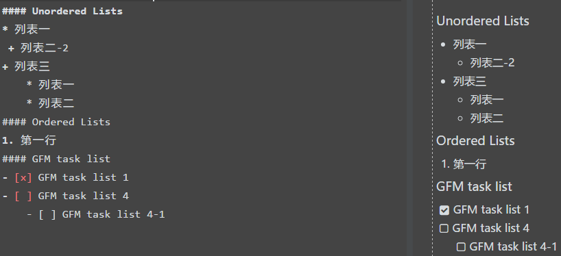

> * Markdown 是一种轻量级标记语言，比html等要来的直观、好接受一点。
<br>总的来说就是一种利用各种标记格式来展示好的界面、

同时可以在相关的markdown编辑器网站（下面我列了两个常用的）转换成html、pdf等格式文件。
<br>基本写一遍就熟悉用法了，挺好学的。

> * Markdown的网站编辑器（同时讲解标记用法）
 - [x] [Cmd Markdown 编辑阅读器](https://www.zybuluo.com/mdeditor#537850)
 - [x] [我经常在这网站上编辑](https://pandao.github.io/editor.md/index.html)

#举很多栗子
##这些我自己常用的markdown标记、足以学习：
- **标题**
H1-H6：  
#### 小标题H4的写法 `#### 小标题H4`

- **字体**

 *斜体的写法:*
 `*斜体*`

 **粗体的写法:** 
 `**粗体**`

 <s>删除线的写法</s> 
 `<s>删除线</s>`

 > 注明文本的写法 `> 注明文本`
  

 下标<sub>2</sub>、
 `下标<sub>2</sub>`

 上标<sup>2</sup>、
 `上标<sup>2</sup>`


- **链接**

 [锚点链接](https://github.com/tgqnanman)
 
 `[锚点链接](https://github.com/tgqnanman)`

 <https://github.com>
 
 `<https://github.com>`

- **代码格式**

 ```javascript 
 function test(){
 console.log("Hello world!");
}
```


- **图片**

 引入图片格式： `  `

 

 >值得一说的是这图片*链接地址*不能是本地的（就不能是电脑上的文件）、要是网上的图片链接，当然，可以上传到github然后图片地址名为你的图片名 “picture.jpg”就行了


- **列表（偷个懒，直接上图了）***




- **表格**


